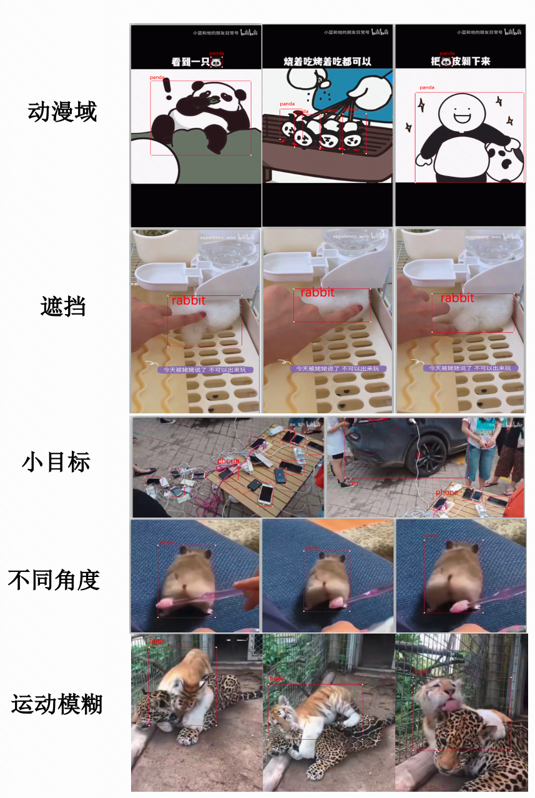

# B20

B20数据集来源于B站视频，经过人工标注后，用于评测开放世界视频目标检测任务。

图片数据在 data 文件夹下，标注在 data/annotations 文件夹下，标注格式参考[COCO目标检测数据集](https://cocodataset.org/#format-data)给出。

## 亮点

+ 超过1200个来自[B站](https://www.bilibili.com/)由用户自行上传的真实世界的视频；
+ 20个类别的目标检测框标注, 包括 *cat*, *dog*, *pig*, *rabbit*, *parrot*, *snake*, *tiger*, *seal*, *panda*, *mouse*, *hamster*, *motorcycle*, *car*, *sports car*, *bicycle*, *phone*, *baby*, *Ultraman*, *skateboard*, *high-heels*；
+ 超过4000个物体级别的由多人校验得到的检测框标注；
+ 具备真实世界目标检测难点：像素低，运动模糊，遮挡，不同域等。

## 与其他数据集比较

| 数据集         | 类别数  |  视频片段数 | 特点 |
| :--             | --:     | :--   |:--   |
| [vid](https://image-net.org/challenges/LSVRC/2017/#vid)          | 30  |  4,237|  类别为imagenet子类 |
| [YTBB](https://research.google.com/youtube-bb/explore.html)       | 23  | 380,000 |视频均为一个显著物体 |
| [EPIC KITCHEN](https://epic-kitchens.github.io/2022)  | 290     | 89,977 | 场景为厨房  |
| **B20** | 20   | 1,270 | 来自B站用户真实拍摄上传的视频 |

